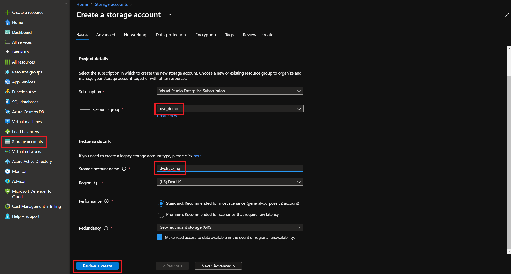
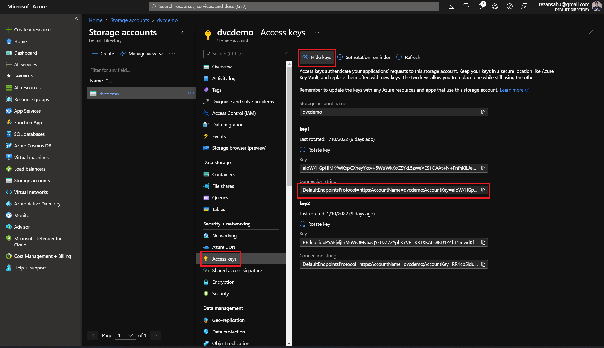

# Using DVC with PyCaret & FastAPI (Demo)

This repo contains all the resources for my demo explaining how to use [DVC](https://dvc.org/) along with other interesting tools & frameworks like [PyCaret](https://pycaret.org/) & [FastAPI](https://fastapi.tiangolo.com/) for data & model versioning, experimentation with ML models & finally deploying these models quickly for inferencing.

_This demo was presented at the DVC Office Hours on 20th Jan 2022._

> _**Note:** We will use Azure Blob Storage as our remote storage for this demo. To follow along, it is advised to either create an Azure account or use a different remote for storage._

***

## Steps Followed for the Demo

### 0. Preliminaries

Create a virtual environment named `dvc-demo` & install required packages

```bash
python3 -m venv dvc-demo
source dvc-demo/bin/activate

pip install dvc[azure] pycaret fastapi uvicorn python-multipart
```

Initialize the repo with DVC tracking & create a `data/` folder

```bash
mkdir dvc-pycaret-fastapi-demo
cd dvc-pycaret-fastapi-demo
git init
dvc init

git remote add origin https://github.com/tezansahu/dvc-pycaret-fastapi-demo.git

mkdir data
```

### 1. Tracking Data with DVC

We use the [Heart Failure Prediction Dataset](https://www.kaggle.com/fedesoriano/heart-failure-prediction) for this demo.

First, we download the `heart.csv` file & retain ~800 rows from this file in the `data/` folder. _(We will use the file with all the rows later - this is to simulate the change/increase in data that an ML workflow sees during its lifetime)_

Track this `data/heart.csv` using DVC

```bash
dvc add data/heart.csv
git add data/heart.csv.dvc
git commit -m "add data - phase 1"
```

### 2. Setup the Remote for Storing Tracked Data & Models

- Go to the Azure Portal & create a **Storage Account** (here, we name it `dvcdemo`)
  

- Within the storage account, create a **Container** (here, we name it `demo20jan2022`)

- Obtain the **Connection String** from the storage account as follows:
   

- Install the Azure CLI from [here](https://docs.microsoft.com/en-us/cli/azure/install-azure-cli-windows?tabs=azure-cli) & log into Azure from within the terminal using `az login`

Now, we store the tracked data in Azure:

```bash
dvc remote add -d storage azure://demo20jan2022/dvcstore
dvc remote modify --local storage connection_string <connection-string>

dvc push
git push origin main
```

### 3. ML Experimentation with PyCaret

Create the `notebooks/` folders using `mkdir notebook` & download the `notebooks/experimentation_with_pycaret.ipynb` notebook from this repo into this `notebooks/` folder.

Track this notebook with Git:

```bash
git add notebooks/
git commit -m "add ml training notebook"
```

Run all the cells mentioned under **Phase 1** in the notebook. This involves basics of PyCaret:
- Setting up a vanilla experiment with `setup()`
- Comparing various classification models with `compare_models()`
- Evaluating the preformance a model with `evaluate_model()`
- Making predictions on the held-out eval data using `predict_model()`
- Finalizing the model by training on the full training + eval data using `finalize_model()`
- Saving the model pipeline using `save_model()`

This will create a `model.pkl` file in the `models/` folder

### 4. Tracking Models with DVC

Now, we track the ML model using DVC & store it in our remote storage

```bash
dvc add models/model.pkl
git add models/model.pkl.dvc
git commit -m "add model - phase 1"

dvc push
git push origin main
```

### 5. Deploy the Model with FastAPI

_First, delete the `.dvc/cache/` & `models/model.pkl` (simulate production env). Then, pull the changes from the DVC remote storage._

```bash
dvc pull
```

Check that the `model.pkl` file is now present in `models/` folder.

Now, create a `server/` folder & place the `main.py` file in it after downloaidng the `server/main.py` file from this repo. This RESTful API server has 2 POST endpoints:
- Inferencing on an individual record
- Batch inferencing on a CSV file

We commit this to our repo:

```bash
git add server/
git commit -m "create basic fastapi server"
```

Now, we can run our local server on port 8000

```bash
cd server
uvicorn main:app --port=8000
```

Go to `http://localhost:8000/docs` & play with the endpoints present in the interactive documentation. 

For the individual inference, you could use teh following data:

```json
{
  "Age": 61,
  "Sex": "M",
  "ChestPainType": "ASY",
  "RestingBP": 148,
  "Cholesterol": 203,
  "FastingBS": 0,
  "RestingECG": "Normal",
  "MaxHR": 161,
  "ExerciseAngina": "N",
  "Oldpeak": 0,
  "ST_Slope": "Up"
}
```

### 6. Simulating the arrival of New Data

Now, we use the **full** `heart.csv` file to simulate the arrival of new data with time. We place it within `data/` folder & upload it to DVC remote.

```bash
dvc add data/heart.csv
git add data/heart.csv.dvc
git commit -m "add data - phase 2"

dvc push
git push origin main
```

### 7. More Experimentation with PyCaret

Now, we run the experiment in **Phase 2** of the `notebooks/experimentation_with_pycaret.ipynb` notebook. This involves:
- Feature engineering while setting up teh experient
- Fine-tuning of models with `tune_model()`
- Creating an ensemble of models with `blend_models()`

The blended model is saved as `models/modl.pkl`

We upload it to our DVC remote.

```bash
dvc add models/model.pkl
git add models/model.pkl.dvc
git commit -m "add model - phase 2"

dvc push
git push origin main
```
### 8. Redeploying the New Model using FastAPI

Now, we again start the server (no code changes required, because the model file has same name) & perform inference.

```bash
cd server
uvicorn main:app --port=8000
```

With this, we demonstrate how DVC can be used in conjunction with PyCaret & FastAPI for iterating & experimenting efficiently with ML models & deploying them with minimal effort.

***

## Additional Resources

- Fundamentals of MLOps: A 4-blog series
    - [A Gentle Introduction to MLOps](https://medium.com/analytics-vidhya/fundamentals-of-mlops-part-1-a-gentle-introduction-to-mlops-1b184d2c32a8)
    - [Data & Model Management with DVC](https://medium.com/analytics-vidhya/fundamentals-of-mlops-part-2-data-model-management-with-dvc-6be2ad284ec4)
    - [ML Experimentation using PyCaret](https://medium.com/analytics-vidhya/fundamentals-of-mlops-part-3-ml-experimentation-using-pycaret-747f14e4c28d)
    - [Tracking with MLFlow & Deployment with FastAPI](https://medium.com/analytics-vidhya/fundamentals-of-mlops-part-4-tracking-with-mlflow-deployment-with-fastapi-61614115436)
- [DVC Documentation](https://dvc.org/doc)
- [PyCaret Documentation](https://pycaret.gitbook.io/docs/)
- [FastAPI Documentation](https://fastapi.tiangolo.com/)

***

<p align="center">Created with ❤️ by <a href="https://www.linkedin.com/in/tezan-sahu/">Tezan Sahu</a></p>
